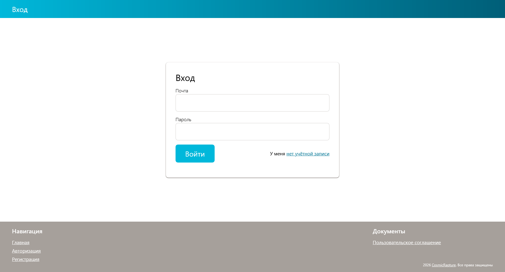
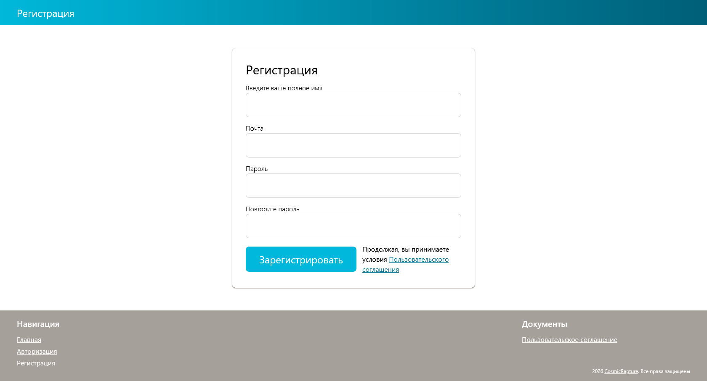
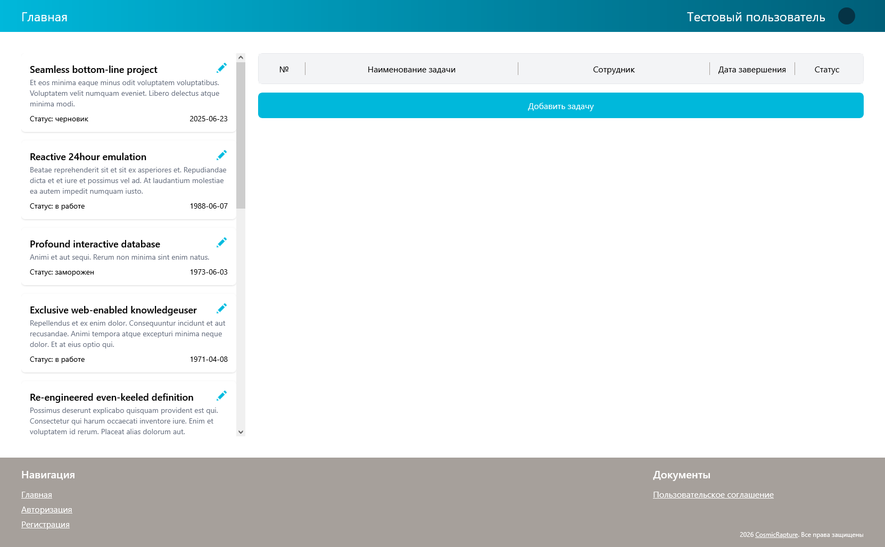
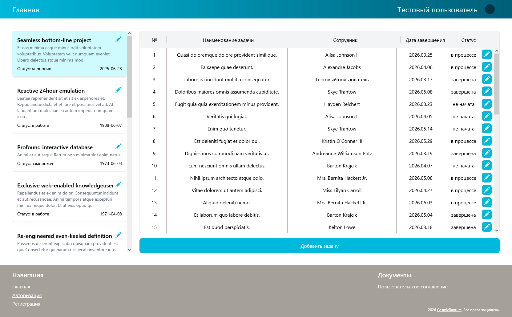
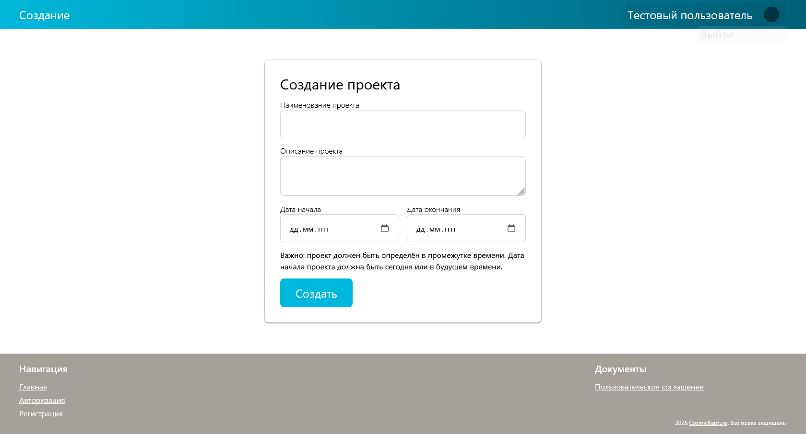
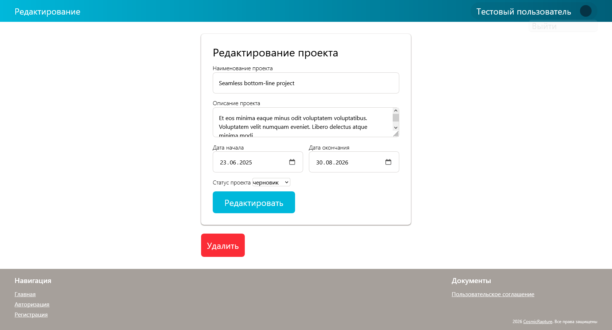

# Laravel project-task manager

Simple task manager inspired by services like Weeek and Trello.

Русская версия: [README.ru.md](README.ru.md)

## Features

- User Authentication
- Project boards and tasks
- CRUD operations with projects and tasks
- Middleware auth

## Stack

- PHP
- Laravel
- MySQL
- JavaScript
- Tailwind CSS

## Installation

Clone repo into yours directory

`git clone https://github.com/wisheddude/Project-manager-laravel`

Go to the directory of the installed project

`cd Project-manager-laravel`

Install dependencies

`composer install`

Rename the environment file

`ren .env.example .env`

Generate an application key

`php artisan key:generate`

Migrate and seed the database

`php artisan migrate --seed`

Install the required packages and compile the styles

`npm install`

`npm run build`

Great, run the project with the command

`php artisan serve`

## Using 

To log in, use the following information: mail@example.com, passwd

## Screenshots

### Login page

### Sign up page

### Main page

### Tasks in project

### Project create page

### Project edit page

